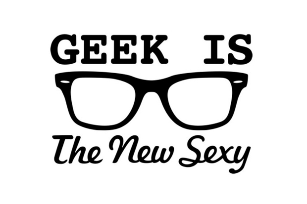
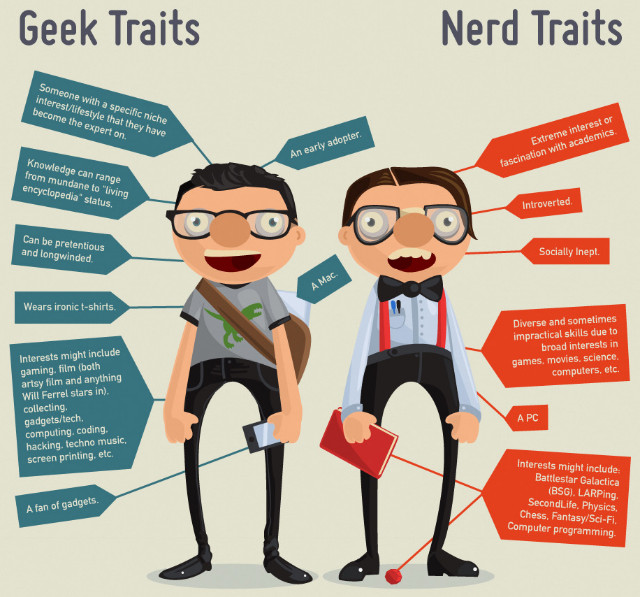

If it were only that simple. 6 months ago I decided on a career change from humanities and social work to programming. I told myself: 'I am too old to start uni all over again'. So that's how I stumbled upon coding bootcamps, a relatively new phenomenon which - duh! - started in the the US and crossed the Atlantic some three years ago. Coding bootcamps provide vocational training for coding, so that in the space of three months one learns the basics and can start a career as a junior developer.

#### `:geek == :nerd # => false`

Just to clarify, in case you are unsure. The following graph proves that beyond any shadow of doubt (thanks to http://geektyrant.com/news/geek-vs-nerd-infographic). I have to admit that some cross-fertilization is possible. For example, I am a huge fan of *Battlestar Galactica*, *Star Wars* and basically anything Sci-fi related. Conversely, at the head of my list of preferred games it *Tetris*, so - arguably - I am not a gamer.

